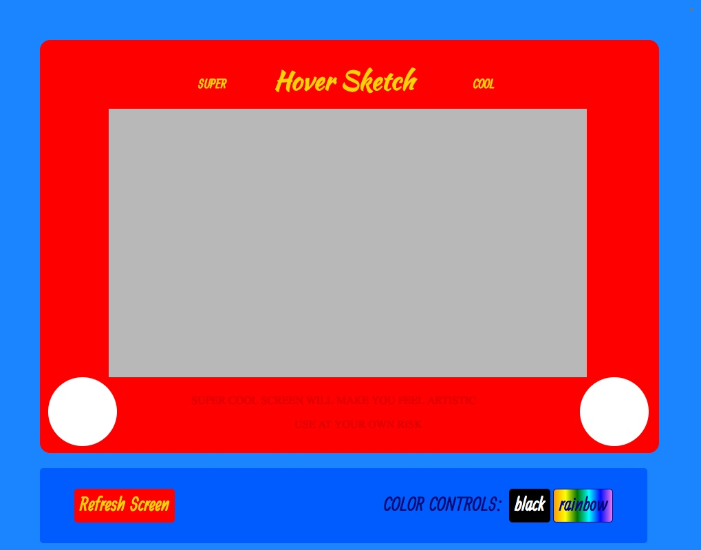

# Hover Sketch

## Etch-A-Sketch project focused on DOM manipulation skills

1. Develop grid in container using JavaScript

2. Allow user to draw by hovering over the grid

3. Allow user the ability to refresh the grid and define granularity

4. Create color options that user can toggle
